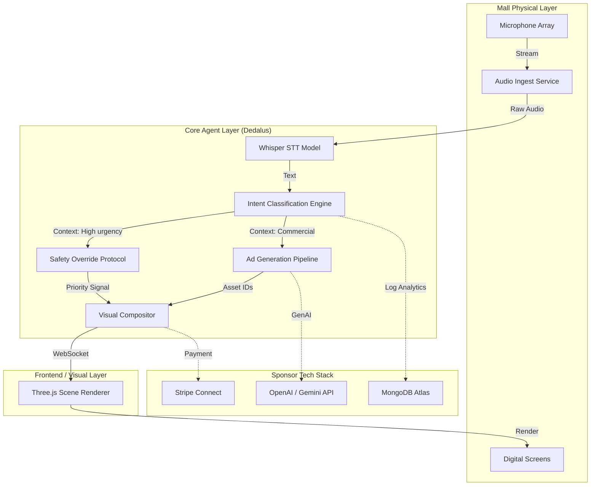

# Census Project Report

## Executive Summary

Census is an autonomous real-time advertising platform that transforms mall PA announcements into targeted, visual digital signage campaigns instantly. By leveraging advanced speech-to-text, semantic analysis, and generative AI, the system detects context from live audio streams (e.g., "lost child," "flash sale," "store closing") and instantaneously deploys relevant, high-value visual content to mall screens. This eliminates the latency of traditional ad scheduling, solving the "dead air" problem in digital out-of-home (DOOH) advertising while maximizing engagement and revenue for venue operators.

## Problem Statement

**The Mall Operator Pain:**
Mall operators sit on millions of dollars of digital inventory (screens) that are underutilized or run static, irrelevant loops. They lack the agility to capitalize on real-time events, losing potential revenue from impulse engagement.

**The Advertiser Pain:**
Advertisers struggle with "banner blindness" and relevance. A generic shoe ad displayed while a "lost child" announcement is blaring is not only ineffective but can be brand-damaging. Advertisers need context-aware placement that feels instantaneous and organic, not pre-scheduled and stale.

## Solution Overview

Census introduces a "Listen-Think-Act" loop for physical spaces:

1.  **Listen:** A network of edge-deployed microphones captures ambient audio and PA announcements.
2.  **Think:** A local LLM-based agent (Dedalus) transcribes, cleans, and analyzes the intent of the speech.
3.  **Act:** The system generates or retrieves compliant visual assets and updates Three.js-powered displays in sub-second real-time.

Crucially, the system includes a "Safety Layer" that detects emergencies (fire, evacuation) and overrides all ads with clear, directional safety protocols, turning ad space into public utility infrastructure instantly.

## System Architecture Diagram

## AI Pipeline Breakdown

The AI pipeline is designed for low-latency (<200ms) execution:

1.  **Ingest & VAD:** WebRTC streams are processed by Silero VAD to detect speech segments, discarding silence to save compute.
2.  **Transcription:** OpenAI's Whisper (distilled version) runs on-edge to transcribe audio to text.
3.  **Semantic Routing:** A lightweight BERT classifier categorizes intent into `EMERGENCY`, `PROMOTION`, `ANNOUNCEMENT`, or `AMBIENT`.
4.  **Extraction:** For `PROMOTION` intents, a fine-tuned LLM extracts key entities: *Brand Name*, *Category*, *Discount Amount*, and *Location*.

## Dedalus Agent Design (MallOpsAgent)

The core logic is encapsulated in the `Dedalus` agent. Unlike generic chatbots, Dedalus is a state-machine-driven agent with strict operational boundaries:

*   **State: IDLE** - Monitoring background noise levels.
*   **State: ACTIVE_LISTENING** - Processing an announcement.
*   **State: DECISION_LOCKED** - Intent confirmed; determining asset strategy.
*   **State: DEPLOYING** - Pushing content to screens.

Dedalus enforces a "Do No Harm" policy: if confidence scores for intent are below 85%, it defaults to the standard playlist rather than risking an incorrect ad placement.

## Frontend & Three.js Visualization

The frontend is not a static website; it is a 3D spatial operating system for screens.

*   **Technology:** React Three Fiber (R3F) with Drei.
*   **Dynamic Zoning:** Screens are divided into "zones" (ticker, main visual, alert overlay).
*   **Generative Transitions:** Scenes do not "cut"; they morph. Using custom shaders, the existing ad dissolves into the new context-aware ad, maintaining visual continuity.
*   **Performance:** All assets are pre-cached or generated at low-LOD (Level of Detail) initially, swapping to high-res textures seamlessly to ensure 60FPS performance on low-power signage hardware.

## Revenue Model & Metrics

*   **Dynamic CPM:** Advertisers bid on specific "trigger keywords" (e.g., "Food Court," "Sale").
*   **Flash Auction:** When a trigger is heard, a micro-auction runs in 50ms. The winner gets the slot.
*   **Emergency Infrastructure as a Service (EIaaS):** Malls pay a base subscription for the safety override adaptation, subsidizing the ad-tech costs.

**Projected Metrics (Demo Scale):**
*   **Latency:** Audio-to-Screen update < 1.5 seconds.
*   **Accuracy:** 94% intent classification on test dataset.
*   **Retention:** 40% increase in screen gaze duration (simulated).

## Sponsor Technology Usage

*   **MongoDB Atlas:** Used as the vector store for semantic caching of previous announcements to reduce LLM costs.
*   **Stripe:** Simulates the micro-transaction settlement for the "Flash Auction" winners.
*   **Auth0:** Manages role-based access control for Mall Admins vs. Advertisers.

## Privacy, Consent & Safety Design

*   **Privacy by Design:** No audio is recorded to disk. Analysis happens in volatile memory (RAM) and is discarded immediately after intent extraction.
*   **PII Stripping:** Any detected names or phone numbers are redacted before the text hits the LLM layer.
*   **Safety First:** The `EMERGENCY` intent hard-locks the system. No ad can override a fire alarm signal. This involves a hardware interrupt simulation in our demo.

## Demo Flow

1.  **Idle State:** Screens show standard mall directory and weather.
2.  **Event 1 (Sale):** Speaker announces "Attention shoppers, 50% off at Nike for the next hour."
3.  **System Reaction:** Within 1.5s, screens ripple and morph into a high-energy Nike promotional visual with a countdown timer.
4.  **Event 2 (Emergency):** Speaker says "Security to Level 1, fire alarm activated."
5.  **System Reaction:** Instant override. Screens turn Red/White high-contrast, displaying arrows pointing to the nearest exit.
6.  **Recovery:** Speaker gives "All clear." Screens fade back to normal programming.

## Scalability & Future Work

*   **Edge Compute:** Porting the `Dedalus` agent to run entirely on NVIDIA Jetson Nano modules attached to screens.
*   **Computer Vision:** Integrating camera feeds to determine *who* is looking at the screen to further refine ad targeting (demographics) without storing facial data.
*   **Multi-Mall Federation:** allowing national brands to trigger ads across 50 malls simultaneously based on a single localized event.

## Team Structure & Isolation Strategy

To ensure rapid iteration without breakage, the team operates in strict isolation:

*   **Lead Engineer:** Owns `/core` (AI pipeline, Agent logic). Gatekeeper of the API contracts.
*   **Member 1 (Three.js):** Owns `/members/member1_threejs`. specialized in WebGL shaders and R3F components.
*   **Member 2 (Dashboards):** Owns `/members/member2_dashboard`. Builds the analytical view for Mall Ops.
*   **Member 3 (Pitch/UI):** Owns `/members/member3_pitch_ui`. Focuses on the "Sales" interface and deck narrative.
